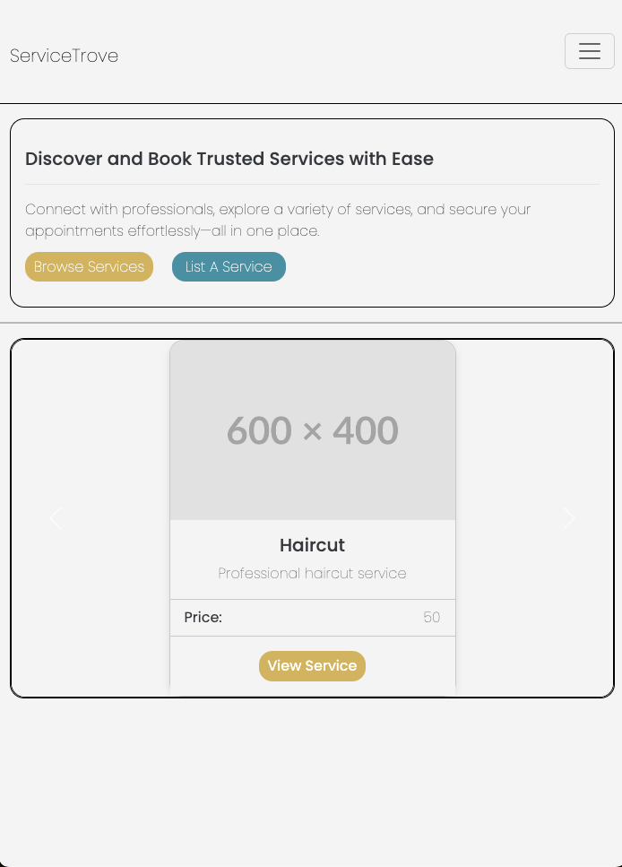
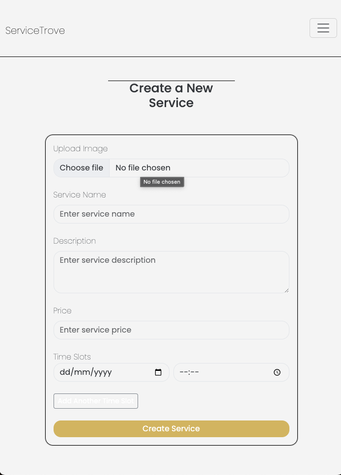
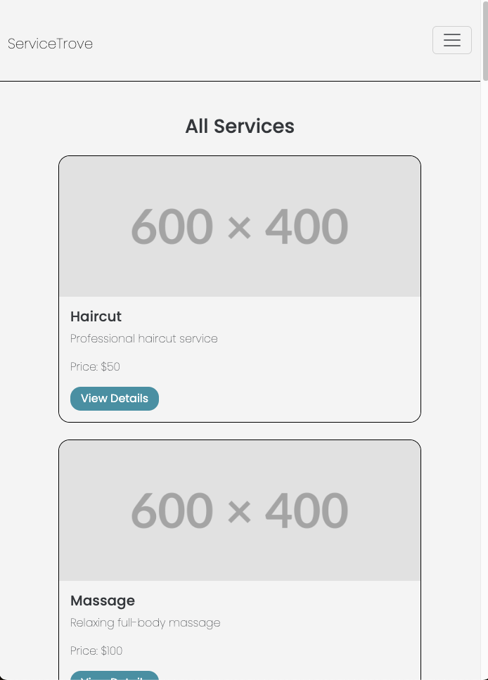
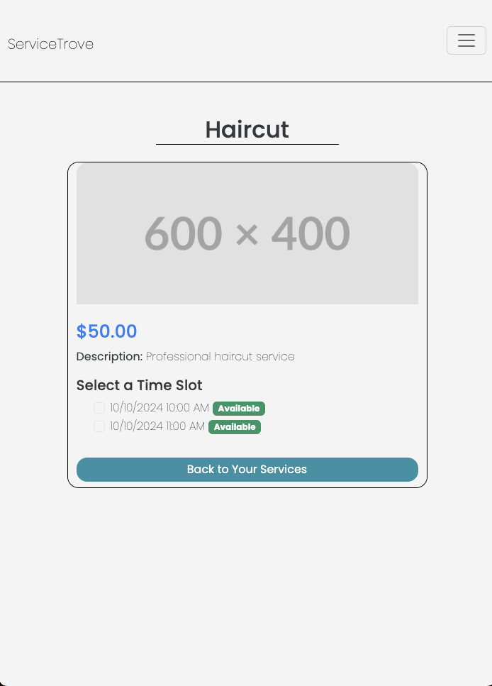

# ServiceTrove

ServiceTrove is a platform that connects **Business Owners** with **Customers** by allowing business owners to list their services, available timeslots, and manage bookings, while customers can browse services, book appointments, and track their engagements.

## Screenshots

### Homepage


### Service Listing


### Services


### View Service



## Features

### For Business Owners:
- **Service Listing:** Create, update, and manage services with descriptions, pricing, and images.
- **Timeslot Management:** Add and manage available times for customers to book.
- **Customer Overview:** View customers who have booked services and their respective appointment times.

### For Customers:
- **Service Browsing:** Explore available services from various business owners.
- **Appointment Booking:** Book services based on available times and make payments (if applicable).
- **Booking Management:** Track and manage upcoming appointments.

### Admin Capabilities:
- Manage business owners and customer data.
- Oversee all services listed on the platform.

## Routes Overview

### Public Routes:
- `/auth/signup?role=Customer`: Customer registration.
- `/auth/signup?role=Business Owner`: Business Owner registration.
- `/auth/signin?role=Customer`: Customer signin.
- `/auth/signin?role=Business Owner`: Business Owner signin.


### Customer Routes:
- `/services`: View all services.
- `/services/:serviceId`: View detailed information about a service and its available timeslots.

### Business Owner Routes:
- `/dashboard`: Manage services and view bookings.
- `/services/new`: Add a new service.
- `/services/:serviceId/edit`: Update existing service information.
- `/services/:serviceId/delete`: Remove an existing service.

## Models

### User
Represents both **Business Owners** and **Customers**.

```javascript
const userSchema = new mongoose.Schema({
    username: { type: String, required: true, unique: true },
    password: { type: String, required: true },
    role: { 
        type: String, 
        enum: ["Business Owner", "Customer"], 
        required: true 
    }
});
```


### Service

```javascript
const serviceSchema = new mongoose.Schema({
    name: { type: String, required: true },
    description: { type: String, required: true },
    price: { type: Number, required: true },
    serviceProvider: { type: mongoose.Types.ObjectId, ref: "User", required: true },
    timeslots: [{
        date: { type: Date, required: true },
        time: { type: String, required: true },
        isBooked: { type: Boolean, default: false }
    }],
    image: { type: String }
});
```
### Timeslot

```javascript
const timeslotsSchema = new mongoose.Schema({
    date: { type: Date, required: true },
    time: { type: String, required: true },
    isBooked: { type: Boolean, default: false }
});

```

## Technologies Used

- **Backend:** Node.js, Express.js
- **Database:** MongoDB, Mongoose
- **Authentication:** Sessions with Express-Session
- **View Engine:** EJS for templating
- **Frontend:** HTML, CSS, JavaScript (optional for frontend interactivity)
- **File Upload:** Multer (for image uploads)

## Future Enhancements

- **Payment Integration:** Add support for payments through third-party services.
- **User Profiles:** Expand user profiles with more details and customization options.
- **Advanced Search:** Implement advanced filtering for services based on location, price, and availability.
- **Notifications:** Set up email or SMS notifications for booking confirmations and reminders.
